# Architecture Deep-Dive

This document is for second-round technical interviews. It describes the design
decisions at each layer of the pipeline, the data contracts between layers, and
the failure modes each layer defends against.

---

## System overview

```mermaid
flowchart LR
    SEC[("SEC EDGAR<br/>XBRL")]
    FRED[("FRED API<br/>macro series")]
    YF[("yfinance<br/>ETF returns")]

    ING["ingest_edgar.py<br/>7 provenance columns<br/>form-priority dedup"]
    PARQUET[("{TICKER}.parquet")]
    WH[("DuckDB<br/>v_* views")]

    BASE["nb/02 baseline_forecast<br/>Prophet + AutoARIMA"]
    MACRO["nb/03 macro_regularized<br/>Lasso + FRED"]
    FCST[("models/*.parquet<br/>forecast medians + CIs")]
    VAR["build_variance_facts.py"]
    VVF[("v_variance_facts")]

    GATE{{"Refusal checks"}}
    STOP[["Refused — exit 1"]]

    EXC["build_excel_model.py<br/>3-statement"]
    TAB["export_for_tableau.py"]
    CMT["generate_commentary.py<br/>reasoning-vs-computation split"]
    GUARD[/"Hallucination guard"/]
    NLM["build_notebooklm_bundle.py"]

    XLSX[("{TICKER}_model.xlsx")]
    CSVS[("tableau_data/<br/>5 CSVs + .hyper")]
    PUB[("Tableau Public<br/>dashboard")]
    MD[("{TICKER}_exec_commentary.md")]
    BUNDLE[("notebooklm_bundle/")]

    SEC --> ING --> PARQUET --> WH
    WH --> BASE --> FCST
    WH --> MACRO
    FRED --> MACRO
    YF --> MACRO
    MACRO --> FCST
    WH --> VAR
    FCST --> VAR
    VAR --> VVF
    VVF --> GATE
    GATE -->|refuse| STOP
    GATE -->|clean| CMT
    WH --> EXC
    FCST --> EXC
    EXC --> XLSX
    WH --> TAB --> CSVS
    CSVS -.->|manual<br/>publish| PUB
    CMT --> GUARD
    GUARD -->|fail| CMT
    GUARD -->|pass| MD
    XLSX --> NLM
    MD --> NLM
    FCST --> NLM
    WH --> NLM
    NLM --> BUNDLE

    classDef source fill:#e0f2fe,stroke:#0284c7,color:#0c4a6e
    classDef pipeline fill:#fef3c7,stroke:#d97706,color:#78350f
    classDef guard fill:#fee2e2,stroke:#dc2626,color:#7f1d1d,stroke-width:2px
    classDef output fill:#dcfce7,stroke:#16a34a,color:#14532d

    class SEC,FRED,YF source
    class ING,BASE,MACRO,VAR,EXC,TAB,CMT,NLM pipeline
    class GATE,GUARD,STOP guard
    class PARQUET,WH,FCST,VVF,XLSX,CSVS,PUB,MD,BUNDLE output
```



---

## Layer 1: Ingestion (`src/ingest_edgar.py`)

**Input:** `data.sec.gov/api/xbrl/companyfacts/CIK{cik}.json`

**Key design decisions:**

### XBRL concept synonym mapping
GAAP revenue uses different XBRL concept names across companies. PANW reports
`RevenueFromContractWithCustomerExcludingAssessedTax`, CRWD uses
`RevenueFromContractWithCustomerIncludingAssessedTax`. The `CONCEPT_SYNONYMS` dict
maps a canonical line item name (`Revenue`) to an ordered list of XBRL concepts to
try in priority order.

**Ordering matters:** ExcludingAssessedTax is tried before IncludingAssessedTax so
that PANW resolves to its correct concept without accidentally picking up a
IncludingAssessedTax value from an older filing.

### 7 provenance columns
Every row in the output parquet carries:
- `concept_used` — the XBRL concept that was actually resolved
- `accession_no` — SEC accession number in canonical form `0001327567-26-000123`
- `fact_id` — SHA-256 (16 chars) of `{ticker}|{concept}|{period_end}|{fp}|{accn}`
- `filing_url` — direct EDGAR URL to the filing document
- `form_type` — `10-K`, `10-Q`, `10-K/A`, `10-Q/A`
- `filed_date` — ISO date
- `frame` — SEC frame tag (e.g. `CY2025Q3I`)

These columns flow through every downstream layer unchanged.

### Form-priority deduplication
When multiple filings cover the same (line_item, period_end), the highest-priority
form wins: `10-K/A (4) > 10-Q/A (3) > 10-K (2) > 10-Q (1)`. Within the same form
type, the later-filed document wins. This implements `QUALIFY ROW_NUMBER() OVER (...)`
semantics in DuckDB.

### Restatement detection (v7)
Only true amendments (10-K/A, 10-Q/A) that materially differ from the prior same-form
filing are flagged. Threshold: `|delta| > $10K OR |relative delta| > 0.1%`. Routine
10-Q → 10-K preliminary-to-final flow is NOT flagged (v6 bug, fixed in v7).

---

## Layer 2: Warehouse (`src/build_warehouse.py`)

**Input:** `data/processed/{TICKER}.parquet`
**Output:** `data/processed/{TICKER}.duckdb`

Eight DuckDB views:

| View | Contents |
|------|----------|
| `v_canonical_facts` | Deduplicated facts at form-priority canonical values |
| `v_income_statement_quarterly` | IS with 7 provenance cols; both Q and FY periods |
| `v_balance_sheet_quarterly` | BS with InventoryNet, AR, AP, DeferredRevenue |
| `v_cash_flow_quarterly` | OCF / investing / financing / FreeCashFlow |
| `v_key_metrics` | Revenue growth, margins, FCF yield, EV/Revenue |
| `v_restatement_details` | Rows where has_restatement=TRUE |
| `v_missing_coverage` | Quarters missing from the variance window |
| `v_data_quality` | Summary flags: has_restatement, missing_quarters, has_physical_inventory |

`v_variance_facts` is built separately (Prompt 7.5 / `src/build_variance_facts.py`)
after forecast parquets exist — it depends on those parquets.

---

## Layer 3: Forecasting (notebooks 02, 03)

Three independent models, all producing the same output schema:
`{model, period_end, yhat, yhat_lower_80, yhat_upper_80, yhat_lower_95, yhat_upper_95}`

| Model | Library | Method | Uncertainty |
|-------|---------|--------|-------------|
| Prophet | `prophet` | Bayesian structural TS (Stan) | Bayesian credible intervals |
| AutoARIMA | `statsforecast` | Auto ARIMA with AICc | Analytic ARIMA intervals |
| LassoCV | `sklearn` | L1-regularized OLS + FRED macro | Bootstrap (200 resamples) |

**All three models are pessimistic about n=20.** Wide intervals are honest.

---

## Layer 4: Excel model (`src/build_excel_model.py`)

Three-statement model: Income Statement, Balance Sheet, Cash Flow, over 12 historical
+ 16 forecast quarters under Base/Bull/Bear scenarios.

**Key invariant:** `BalanceCheck = TotalAssets − (TotalLiabilities + TotalEquity) = 0`
by construction. Cash is computed as the balancing item:
`Cash_{t} = Cash_{t-1} + OCF + InvestingCF + FinancingCF`.

**Verification:** Python-side re-computation, not `openpyxl data_only=True` (which
returns `None` on fresh workbooks — a real silent-failure mode).

**Sources sheet:** Every line-item × quarter cell carries `accession_no` and
`filing_url` for full provenance to source SEC filings.

---

## Layer 5: Tableau export (`src/export_for_tableau.py`)

Star schema for Tableau:

```
fact_financials ──► dim_date
                ──► dim_metric
                ──► dim_filing (accession_no → filing_url tooltip)

fact_forecasts  ──► dim_date
```

`dim_filing` enables Tableau tooltip click-through to SEC EDGAR. Every data point can
show "Source: 0001327567-26-000123 → [click to open filing]".

---

## Layer 6: Commentary (`src/generate_commentary.py`)

Five-step reasoning-vs-computation pattern:

1. **Pull** — query `v_variance_facts` and `v_data_quality` from DuckDB
2. **Refuse** — `has_restatement=TRUE`, missing quarters, or null fiscal year → exit 1
3. **Format** — every dollar as `$1.2B`, every ratio as `3.2%`, bundled with accession
4. **Claude** — narrator (sonnet-class) writes markdown; system prompt forbids math
5. **Guard** — parse-then-compare; `HallucinationError` on any policy violation

**Runtime model selection:** `src/select_models.py` queries `/v1/models` at startup,
picks highest-generation opus (planner) and sonnet (narrator) available to the API key.
Fallback to config snapshot IDs if discovery fails.

---

## Layer 7: Eval harness (`tests/eval/`)

Five ground-truth scenarios with deterministic expected outputs:

| Scenario | Input condition | Expected output |
|----------|----------------|-----------------|
| VOLUME | Δrevenue × prior_margin >> Δmargin × revenue | Driver: "volume" |
| MARGIN | Δmargin × revenue >> Δrevenue × prior_margin | Driver: "margin" |
| ONE-TIME | one_time=TRUE item > 30% of Δ | Driver: "one-time" |
| MIX-NOT-COMP | Neither dominates; no disaggregated data | Hedge: "not computable" |
| RESTATEMENT | has_restatement=TRUE | Exit 1; no API call |

Driver classification is pure Python arithmetic — no LLM call needed for the test.
The harness builds synthetic commentary strings (`_make_mock_commentary`) and runs
them through the real refusal logic and hallucination guard, validating the
**plumbing around the LLM** rather than the LLM itself. End-to-end live-model
evaluation is v2 work.

---

## Data contract between layers

Every layer passes facts using the same 7 provenance columns. The `accession_no` column
is the primary key linking:
- `ingest_edgar` output parquet
- DuckDB warehouse views
- Excel Sources sheet
- Tableau `dim_filing`
- Commentary payload JSON
- Commentary output inline citations `[0001327567-26-000123]`

A recruiter can take any number from the commentary, find its `[accession_no]` citation,
look it up in `dim_filing`, and follow the `filing_url` to the source SEC document.
This end-to-end traceability is the core portfolio differentiator.
